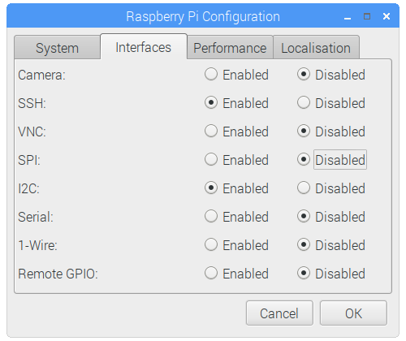

# Power-Monitor-HAT
3 Channel current/voltage moinitor HAT for Raspberry Pi/Arduino/STM32 using I2C or SMBus interface.

##  For Raspberry Pi


* First enable i2c interface by running "sudo raspi-config" command then select interfacing options >> I2C >> click on enter to enable it.

                                              OR
                                              
You can also use GUI to enable i2c, click on Menu > Preferences > Raspberry Pi Configuration > interfaces, Then enable I2C



* Open Terminal and install dependency required to run power monitoring HAT.

``` sudo pip3 install adafruit-circuitpython-ina219 ```

* Now Clone repository and run example code.

``` git clone https://github.com/sbcshop/Power-Monitor-HAT.git ```

``` cd Power-Monitor-HAT ```

``` cd RaspberryPi ```

``` python3 demo.py ```
